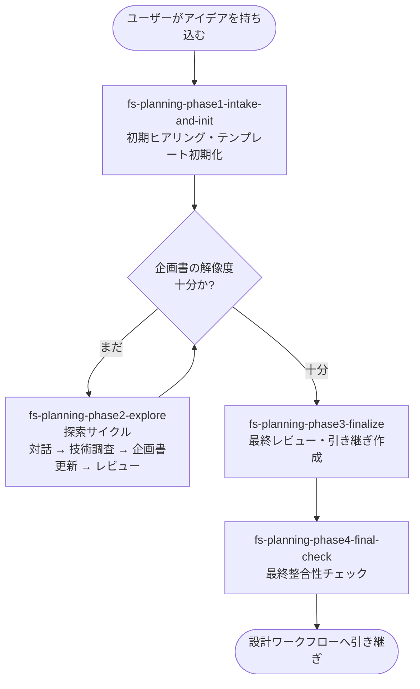

# 企画ワークフロー

漠然としたアイデアから、設計ワークフローへ引き継げる粒度の **開発企画書（planning-proposal.md）**
を作るためのワークフロー。

## 適用場面

| 状況 | 対応 |
|---|---|
| アイデア段階の新規プロジェクト | 本ワークフローで企画書を作る |
| 要件が既に明確 | 設計ワークフロー（`fs-design-phase1-user-req`）から始める |
| 既存コードがある | 設計逆引きワークフロー（`fs-reverse-phase1-program`）から始める |

ユーザーの「作りたい」「新しいアプリ」「アイデアがある」「企画」といった発話を
ハブスキルが拾い、エントリポイントスキル `fs-planning-phase1-intake-and-init` が起動する。

## ワークフローの目的

- ユーザーの漠然としたアイデアを **対話・技術調査・レビュー** の探索サイクルで構造化する
- 企画書、ユーザープロファイル、技術調査結果、引き継ぎメモを揃える
- 設計ワークフローが迷わず始められる状態に整える

## フェーズの流れ

### フェーズ一覧

| 順序 | フェーズスキル | 役割 |
|---|---|---|
| 1 | `fs-planning-phase1-intake-and-init` | 7 項目の初期ヒアリング、既存資料の構造化、ユーザープロファイル初期判定、企画書テンプレートの初期化 |
| 2 | `fs-planning-phase2-explore` | 対話 → 技術調査 → 企画書更新 → レビューの探索サイクル。区切り条件に該当したらレビューを必ず実行 |
| 3 | `fs-planning-phase3-finalize` | 最終レビュー（10 観点 ×5 段階）、ユーザー最終合意、引き継ぎメモ作成 |
| 4 | `fs-planning-phase4-final-check` | ワークフロー全体の最終整合性チェック |

## 主要成果物

すべて `.aide/specs/{feature_name}/` 配下に作成される。

| 成果物 | 作成フェーズ | 内容 |
|---|---|---|
| `planning-proposal.md` | フェーズ1（テンプレート）→ フェーズ2（更新）→ フェーズ3（最終） | 企画書本体 |
| `user-profile.md` | フェーズ1で作成、以降随時更新 | ユーザー技術レベル（ドメイン / プログラミング / システム・インフラの 3 軸 ×5 段階） |
| `session-notes.md` | フェーズ1で作成、サイクルごとに追記 | 確定事項・検討中・調査依頼・提案事項・却下事項を整理したメモ |
| `source-materials/*.md` | フェーズ1（資料提供時のみ） | ユーザー提供資料の構造化結果 |
| `tech-investigation/*.md` | フェーズ2（必要に応じて） | 技術調査結果 |
| `handover-notes.md` | フェーズ3 | 設計ワークフローへの引き継ぎメモ（5 セクション必須） |
| `doc-index.md` | 全フェーズで更新 | 成果物のインデックス |
| `planning-progress.md` | 全フェーズで更新 | フェーズ進捗 |

## レビュー（QA ゲートではないが品質保証あり）

設計ワークフローの QA ゲートとは別の、企画書専用の **10 観点 ×5 段階レビュー** が
探索サイクルと最終化フェーズで動く。

- **サイクルレビュー**（フェーズ2）: 区切り条件（技術調査一段落、複数セクション更新、方向性転換、ユーザー希望）に
  該当したら毎回実行。総合判定は 8 観点（観点 4・5 を除く）で `READY / ALMOST / NEEDS_WORK` を出す。
- **最終レビュー**（フェーズ3）: 同じ 10 観点で再評価し、READY を取れた時点で
  ユーザーの最終合意を取りに行く。

レビューは `proposal-reviewer` プロンプトテンプレート経由で汎用サブエージェントに委譲する。

## 連携する共通スキル

| 共通スキル | 用途 |
|---|---|
| `progress-resume-check` | フェーズ先頭での再開判定 |
| `rules-distribute`（skill モード） | フェーズ固有ルールの配置・撤去 |
| `user-profile-management` | ユーザー技術レベルの初期判定・随時更新 |
| `tech-investigation` | 技術要素の最新情報調査 |
| `doc-index-maintenance` | 成果物作成・更新後のインデックス更新 |
| `git-commit-workflow` | フェーズ完了時のコミット |
| `pending-issues-management` | スコープ外の問題発見時の記録（稀） |
| `visual-companion` | アーキテクチャ構成図・技術比較表の視覚提示 |

## 委譲する共通エージェント

企画ワークフローでは、QAレビューアーや実装エージェントは登場しない。
代わりに以下の **プロンプトテンプレート駆動型サブエージェント** に委譲する。

| 委譲先 | 起動方法 | 役割 |
|---|---|---|
| `source-material-organizer` | `source-material-organizer-prompt.md` 経由で汎用サブエージェント | ユーザー提供資料を `source-materials/` 配下に構造化 |
| `proposal-writer-init` | `proposal-writer-init-prompt.md` 経由で汎用サブエージェント | 企画書テンプレートの初期化 |
| `proposal-writer-update` | `proposal-writer-update-prompt.md` 経由で汎用サブエージェント | session-notes と技術調査結果を企画書に反映 |
| `proposal-reviewer` | `proposal-reviewer-prompt.md` 経由で汎用サブエージェント | 10 観点 ×5 段階のサイクルレビュー / 最終レビュー |

これらは `agents/` 配下の名前付き共通エージェントではなく、企画スキル内に閉じた
プロンプト経由のサブエージェント呼び出しである点に注意。

## 設計ワークフローへの引き継ぎ

最終フェーズ完了時点で、以下を揃えた状態で設計ワークフローへ渡す。

- `planning-proposal.md`（最終版）
- `user-profile.md`
- `tech-investigation/`（技術調査結果）
- `source-materials/`（資料がある場合）
- `handover-notes.md`（注意点・意思決定の経緯・妥協点・未解決課題・ユーザー所感）
- `doc-index.md`

`handover-notes.md` は設計ワークフローが必ず読み込む引き継ぎメモであり、
作成は `fs-planning-phase3-finalize` の Iron Law として強制される。
