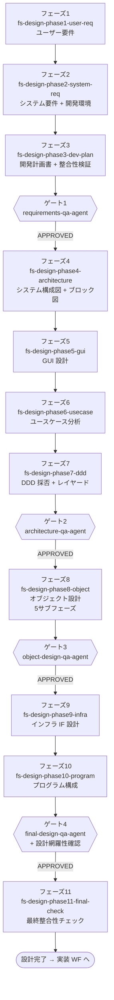

# 設計ワークフロー

ユーザー要件から **実装可能なレベルの設計書一式** を作るためのワークフロー。
11 フェーズで構成され、4つの QA ゲートで品質を担保する。

## 適用場面

| 状況 | 対応 |
|---|---|
| 企画ワークフローを完了した（handover-notes.md がある） | 引き継ぎを読み込んでフェーズ1から開始 |
| 要件は明確だが企画は不要 | 直接フェーズ1から開始 |
| 既存コードから設計書を起こしたい | 設計逆引きワークフローを先に実行 |

ユーザーの「要件は決まっている」「設計して」「仕様書」といった発話を
ハブスキルが拾い、エントリポイントスキル `fs-design-phase1-user-req` が起動する。

## ワークフローの目的

- ユーザー要件・システム要件・開発計画を確定する
- アーキテクチャ・GUI・ユースケース・レイヤー構造・オブジェクト・インフラ IF・プログラム構成を順次設計する
- 4つの QA ゲートを全て APPROVED にして「実装可能な設計書一式」として封印する

## フェーズの流れ

REJECTED の場合は対応するフェーズに戻り、修正後に **再 QA** を必ず実行する。
「修正したから大丈夫」という自己判断による再 QA 省略は Iron Law 違反。

### フェーズ一覧

| 順序 | フェーズスキル | 役割 | ゲート |
|---|---|---|---|
| 1 | `fs-design-phase1-user-req` | 目的と手段を分離して MoSCoW + EARS で構造化 | — |
| 2 | `fs-design-phase2-system-req` | 技術スタック・非機能要件・開発環境定義 | — |
| 3 | `fs-design-phase3-dev-plan` | 要件整合性検証・開発計画書作成 | **ゲート1**（要件定義レビュー） |
| 4 | `fs-design-phase4-architecture` | システム全体構成図・ブロック図 | — |
| 5 | `fs-design-phase5-gui` | GUI 設計（GUI なしプロジェクトはスキップ） | — |
| 6 | `fs-design-phase6-usecase` | UC 網羅 → 実現プロセス → 操作性評価 → 改善の 4 段階 | — |
| 7 | `fs-design-phase7-ddd` | DDD 採否判断・レイヤードアーキテクチャ・ユビキタス言語初期版 | **ゲート2**（アーキテクチャレビュー） |
| 8 | `fs-design-phase8-object` | ドメイン → アプリ → インフラ → プレゼン → サマリの 5 サブフェーズ | **ゲート3**（オブジェクト設計レビュー） |
| 9 | `fs-design-phase9-infra` | API 定義 / DB スキーマ / 外部連携 / リポジトリ実装 | — |
| 10 | `fs-design-phase10-program` | フォルダ配置 / import ルール / 命名規則 | **ゲート4**（最終設計レビュー + 設計網羅性確認） |
| 11 | `fs-design-phase11-final-check` | ワークフロー全体の最終整合性チェック | — |

## 主要成果物

| 成果物 | 作成フェーズ | 内容 |
|---|---|---|
| `user-requirements.md` | 1 | ユーザー要件（EARS + MoSCoW） |
| `system-requirements.md` | 2 | 技術スタック・非機能要件 |
| `dev-environment.md` | 2 | 実行環境・テスト実行コマンド・依存管理方針 |
| `development-plan.md` | 3 | 開発スコープ・進め方・体制 |
| `system-architecture.md` | 4 | システム全体構成図・ソフトウェアブロック図 |
| `gui-design.md` | 5 | 画面構成・遷移図・共通 UI ルール |
| `usecases/usecase-list.md` ほか | 6 | UC 一覧と各 UC の詳細・評価・改善案 |
| `usecases/usecase-analysis.md` | 6 | ユースケース分析の最終まとめ |
| `layered-architecture.md` | 7 | レイヤー構造・DDD 採否判断・依存方向 |
| `ubiquitous-language.md` | 7 〜 8 | DDD 採用時のユビキタス言語辞書 |
| `object-design-domain.md` | 8 | ドメイン層クラス設計 |
| `object-design-application.md` | 8 | アプリケーション層クラス設計 |
| `object-design-infrastructure.md` | 8 | インフラ層クラス設計 |
| `object-design-presentation.md` | 8 | プレゼンテーション層クラス設計 |
| `object-design.md` | 8（サマリ） | 全レイヤーの俯瞰図 |
| `infra-interface-design.md` | 9 | API / データストア / 外部サービス / リポジトリ実装 |
| `program-structure.md` | 10 | フォルダ配置 / import ルール |

メタファイル（`doc-index.md` / `design-progress.md`）は全フェーズで更新される。

## QA ゲートの構造

各ゲートは `design-qa-dispatch` 共通スキルが集中管理し、対応するQAレビューアーエージェントを呼ぶ。
詳細は `04-agents/README.md` を参照。

| ゲート | 配置 | 担当QAレビューアーエージェント | 主な検証観点 |
|---|---|---|---|
| ゲート1 | フェーズ3完了後 | `requirements-qa-agent` | EARS 構文準拠 / MoSCoW 妥当性 / エラーハンドリング方針網羅 / Must 要件対応漏れ |
| ゲート2 | フェーズ7完了後 | `architecture-qa-agent` | DDD 採用判断の妥当性 / レイヤー間依存方向 / 依存性逆転 / DDD 設計方針 |
| ゲート3 | フェーズ8完了後 | `object-design-qa-agent` | ドメインモデル貧血症 / 技術浸食 / SOLID / ユビキタス言語整合 / テスタビリティ |
| ゲート4 | フェーズ10完了後 | `final-design-qa-agent` | インフラ IF 整合 / プログラム構成網羅 / import ルール / **全設計網羅性確認** |

`final-design-qa-agent` のゲート4は、user-requirements.md の全項目をオブジェクト設計まで
辿れるかを横断確認する **設計ワークフロー最後の砦**。

## 連携する共通スキル

| 共通スキル | 用途 |
|---|---|
| `progress-resume-check` | フェーズ先頭での再開判定 |
| `rules-distribute`（skill モード） | フェーズ固有ルールの配置・撤去 |
| `user-requirements-definition` | フェーズ1のユーザー要件定義（create / fix モード） |
| `system-requirements-definition` | フェーズ2のシステム要件定義（create / fix モード） |
| `gui-design` | フェーズ5の GUI 設計（create モード） |
| `usecase-analysis` | フェーズ6のユースケース分析 |
| `ddd-modeling` | フェーズ7・8a のレイヤード / ドメイン層設計 |
| `object-design` | フェーズ8のアプリ / インフラ / プレゼン層設計 |
| `infra-interface-design` | フェーズ9のインフラ IF 設計（create / fix モード） |
| `program-structure-design` | フェーズ10のプログラム構成設計（create / fix モード） |
| `design-qa-dispatch` | 4ゲートのQAレビューアー呼び出し |
| `doc-index-maintenance` | 設計書作成・更新後のインデックス更新 |
| `git-commit-workflow` | フェーズ完了時 / QA APPROVED 後のコミット |
| `pending-issues-management` | スコープ外の問題発見時の記録 |
| `tech-investigation` | 技術調査が必要な場面（1% ルール自動発動） |
| `visual-companion` | システム構成図・GUI モックアップ・依存関係図の視覚提示 |

## 委譲する共通エージェント

| エージェント | 呼び出される箇所 | 役割 |
|---|---|---|
| `requirements-qa-agent` | ゲート1 | 要件定義書群を APPROVED / REJECTED 判定 |
| `architecture-qa-agent` | ゲート2 | アーキテクチャ設計書を APPROVED / REJECTED 判定 |
| `object-design-qa-agent` | ゲート3 | オブジェクト設計書 + ユビキタス言語辞書を判定 |
| `final-design-qa-agent` | ゲート4 | インフラ IF + プログラム構成 + 全設計網羅性を判定 |

実装エージェント（`micro-impl-agent`）やコードレビューアー（`design-review-agent` / `code-review-agent`）は
設計ワークフローでは **登場しない**。コード実装と内部品質レビューは実装ワークフロー側の責務。
