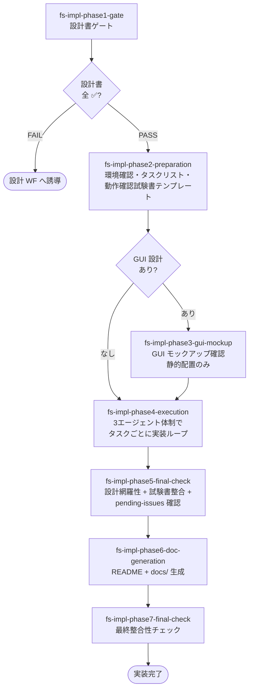

# 実装ワークフロー

完成済みの設計書一式をもとに、**多段階コードレビュー** を通したコード実装を行うワークフロー。
ワークフローの中核は `fs-impl-phase4-execution` の「3エージェント体制 + 全工程フル実行」のループ。

## 適用場面

| 状況 | 対応 |
|---|---|
| 設計書一式が完了している（doc-index.md で全 ✅ 完了） | 本ワークフローで実装する |
| 設計書がない・不完全 | `fs-impl-phase1-gate` が FAIL を返し、設計ワークフローへ誘導 |
| 既存コードへの追加・修正 | 変更ワークフローまたはバグ修正ワークフロー |

ユーザーの「実装して」「コードを書いて」「タスクリスト」といった発話を
ハブスキルが拾い、エントリポイントスキル `fs-impl-phase1-gate` が起動する。

## ワークフローの目的

- 設計書ゲートで **設計書の完了状態を機械的に確認** する
- 開発環境を確認・構築し、依存関係に基づいたタスクリストを生成する
- 1 タスク 1 ファイルの粒度で、実装∥テスト実装 → テスト実行 → 設計準拠∥コード品質レビューの工程内並列で回す
- 全タスク完了後、設計網羅性と動作確認試験書の整合を最終確認する
- README.md と開発者向けドキュメントを生成する

## フェーズの流れ

### フェーズ一覧

| 順序 | フェーズスキル | 役割 |
|---|---|---|
| 1 | `fs-impl-phase1-gate` | 設計書ゲート（ハードゲート）。doc-index.md の全設計書状態と `.kiro/specs → .aide/specs` のマイグレーション確認 |
| 2 | `fs-impl-phase2-preparation` | 開発環境の確認・構築、設計書からタスクリスト生成、動作確認試験書テンプレート作成 |
| 3 | `fs-impl-phase3-gui-mockup` | GUI 静的配置のみ実装してユーザー確認。GUI なしプロジェクトはスキップ |
| 4 | `fs-impl-phase4-execution` | タスクリストの全タスクを 3エージェント体制で実装。ワークフローの核心 |
| 5 | `fs-impl-phase5-final-check` | 全設計書項目の実装漏れ確認、動作確認試験書の網羅性確認、pending-issues 記録漏れ確認 |
| 6 | `fs-impl-phase6-doc-generation` | README.md と docs/ を設計書から再構成して生成 |
| 7 | `fs-impl-phase7-final-check` | ワークフロー全体の最終整合性チェック |

## ゲート

### 設計書ゲート（フェーズ1）

`design-gate` 共通スキルが doc-index.md を読んで以下を機械的に判定する。

| 判定 | 条件 | 次の動作 |
|---|---|---|
| PASS | 全設計書が `✅ 完了` または `⏭️ スキップ` | フェーズ2へ進む |
| FAIL | いずれかが未完了 | ワークフローを停止し、設計ワークフローへ誘導 |

ユーザーが「設計書なしで進めたい」と言っても、設計書完成を先に行うことを説明し合意を得てから、
設計ワークフローを実行する。Iron Law。

### 多段階コードレビュー（フェーズ4のタスクごと）

ホワイトリスト3エージェント体制で、1 タスクごとに工程内並列化（実装∥テスト実装 → テスト実行 →
設計準拠∥コード品質レビュー）を **省略禁止** で全工程実行する。パイプライン全体は
[`multi-stage-code-review` 共通スキル](../03-common-skills/impl.md#multi-stage-code-review)
が司る。詳細はそちらを参照。

非プログラム成果物（設定ファイル等）の場合は「実装 → 設計準拠レビューのみ」で完了。
判定基準は `fs-impl-phase4-execution` の「成果物種別の判定」セクションに従う。

## 主要成果物

| 成果物 | 作成フェーズ | 内容 |
|---|---|---|
| `impl-task-list.md` | 2 | 依存関係に基づくタスクリスト |
| `testing/manual-test-plan.md` | 2（テンプレート）→ 4（タスクごとに追記） | 動作確認試験書 |
| `impl-process-checklist.md` | 4 | 工程チェック表（1工程1行構造。5工程行/非プログラムは➖skip行） |
| 実装コード一式 | 4 | プロジェクト本体 |
| テストコード一式 | 4 | 各実装に対応するテスト |
| `README.md` | 6 | プロジェクトの「顔」 |
| `docs/` | 6 | 開発者向けドキュメント |

## Iron Law

実装ワークフローは Iron Law が特に厚い。フェーズスキル本文の宣言を抜粋する。

- **NEVER SKIP A STEP WITHIN A TASK**: 1 タスク内の 8 ステップ（または非プログラム成果物の 3 ステップ）を省略禁止。
- **NEVER BATCH MULTIPLE TASKS**: 1 タスク完遂後に次のタスクへ。複数タスクを一括実装してまとめてレビューは禁止。
- **NEVER PROCEED WITHOUT BOTH REVIEWS PASSING**: 設計準拠と品質の両 PASS なしに次工程へ進めない。
- **PROCESS CHECKLIST MUST BE UPDATED AT EACH STEP**: 工程チェック表を各ステップ完了時に必ず更新。更新は名前付きエージェントが行い、オーケストレーターによる代筆を禁止。

## 連携する共通スキル

| 共通スキル | 用途 |
|---|---|
| `design-gate` | フェーズ1の設計書ゲート判定 |
| `progress-resume-check` | フェーズ先頭での再開判定 |
| `rules-distribute`（skill モード） | フェーズ固有ルールの配置・撤去 |
| `impl-task-planning` | フェーズ2のタスク分解（依存関係グラフ + トポロジカルソート） |
| `multi-stage-code-review` | フェーズ4の 2 段階レビューパイプライン |
| `impl-coding-standards` | `micro-impl-agent` が従うコーディング規約・粒度・テストルール |
| `code-quality-review` | `code-review-agent` が参照するコード品質観点 |
| `error-handling-review` | `code-review-agent` の implementation モードで参照する例外設計観点 |
| `import-review` | `design-review-agent` が参照する import 方向性チェック |
| `test-review` | テストレビュー時のカバー率 + 方針準拠観点 |
| `design-sync` | 実装と設計が乖離した場合の同期 |
| `task-orchestration` | 大量タスクの並列分解 |
| `doc-index-maintenance` | 成果物更新後のインデックス更新 |
| `git-commit-workflow` | フェーズ完了 / GUI モックアップ確認後 / README 完了時のコミット |
| `pending-issues-management` | スコープ外問題の記録 |

## 委譲する共通エージェント（ホワイトリスト3エージェント）

工程チェック表で自工程行の3段階更新を許される実行担当は、以下の3エージェントのみ。
オーケストレーター自身が工程行を更新することや、自己チェック用サブエージェントの新規作成は禁止。

| エージェント | モード | 役割 |
|---|---|---|
| `micro-impl-agent` | implement / fix / write_test / fix_test / run_test | 1 タスク 1 ファイル単位の実装・修正・テスト作成・テスト実行 |
| `design-review-agent` | implementation / test | 設計準拠レビュー（外を見る）+ import ルール検証 |
| `code-review-agent` | implementation / test | コード品質レビュー（中を見る）+ エラーハンドリング検証 |

## 設計書ゲート FAIL 時の動作

`fs-impl-phase1-gate` が FAIL を返した場合、ユーザーに状況を説明し、設計ワークフローへの誘導を提案する。
進行中の実装ワークフローはここで停止する。
