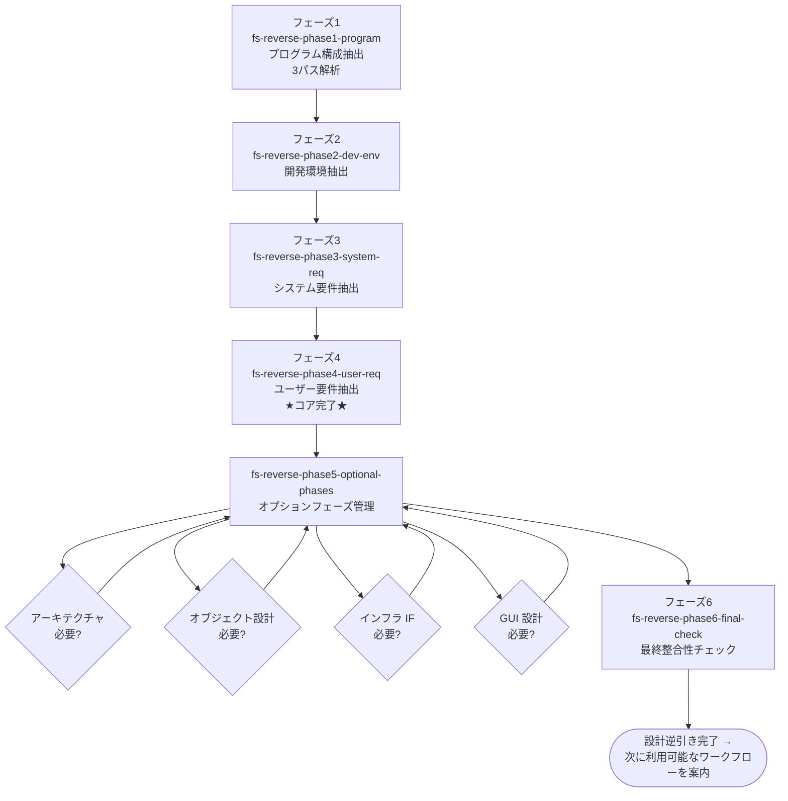

# 設計逆引きワークフロー

既存コードベースから **設計書を逆生成** するためのワークフロー。
理想ではなく **コードの現実をそのまま記録** することが核心。

## 適用場面

| 状況 | 対応 |
|---|---|
| コードはあるが設計書がない | 本ワークフローで設計書を起こす |
| 古い設計書はあるがコードと乖離している | 本ワークフローで現状を記録し直す |
| ゼロから新規開発 | 設計ワークフロー（場合により企画ワークフローから） |

ユーザーの「設計書がない」「設計書を起こして」「構造を把握したい」「既存コードから逆引き」
といった発話をハブスキルが拾い、エントリポイントスキル `fs-reverse-phase1-program` が起動する。

## ワークフローの目的

- 既存コードベースのファイル構成・依存関係を機械的に抽出する
- 開発環境設定ファイル・コード実態からシステム要件を抽出する
- コード挙動とユーザーヒアリングの組み合わせでユーザー要件を復元する
- 必要に応じてアーキテクチャ・オブジェクト設計・インフラ IF・GUI の各設計書を逆生成する

## フェーズの流れ

### フェーズ一覧

| 順序 | フェーズスキル | 役割 |
|---|---|---|
| 1 | `fs-reverse-phase1-program` | 既存コードベースをファイル → モジュール → ディレクトリの 3 パスで解析し `program-structure.md` を生成 |
| 2 | `fs-reverse-phase2-dev-env` | package.json / pyproject.toml / Makefile などから `dev-environment.md` を生成 |
| 3 | `fs-reverse-phase3-system-req` | コードの現実から技術スタック・非機能要件・エラーハンドリング方針を抽出して `system-requirements.md` を生成 |
| 4 | `fs-reverse-phase4-user-req` | コード挙動から推測 + ユーザーヒアリングで `user-requirements.md` を生成。**ここでコア完了** |
| 5 | `fs-reverse-phase5-optional-phases` | コード構造を分析し、オプションフェーズ（アーキテクチャ / オブジェクト設計 / インフラ IF / GUI）の実行可否を判定し、必要なものを順次実行 |
| 6 | `fs-reverse-phase6-final-check` | ワークフロー全体の最終整合性チェック |

## オプションフェーズ

`fs-reverse-phase5-optional-phases` は以下の各設計書を **コードに該当する実装が存在する場合のみ** 逆生成する。

| 対象 | 利用する共通スキル | スキップ条件 |
|---|---|---|
| アーキテクチャ（`layered-architecture.md`） | `ddd-modeling`（reverse モード） | レイヤー分離が読み取れない場合 |
| オブジェクト設計（`object-design-*.md`） | `object-design`（reverse モード） | クラスベース設計が検出されない場合 |
| インフラ IF（`infra-interface-design.md`） | `infra-interface-design`（reverse モード） | インフラ層の実装が見当たらない場合 |
| GUI 設計（`gui-design.md`） | `gui-design`（reverse モード） | GUI フレームワークの import が検出されない場合 |

## 主要成果物

| 成果物 | 作成フェーズ | 内容 |
|---|---|---|
| `program-structure.md` | 1 | フォルダ配置・ファイル一覧・依存関係 |
| `dev-environment.md` | 2 | 実行環境・テストコマンド・依存管理方針 |
| `system-requirements.md` | 3 | 技術スタック・非機能要件（コードから読み取れる事実のみ） |
| `user-requirements.md` | 4 | ユーザー要件（推測 + ユーザーヒアリングによる確定） |
| `layered-architecture.md` | オプション | DDD 採否を含むレイヤー構造（コード現実準拠） |
| `object-design-*.md` | オプション | レイヤー別クラス設計 |
| `infra-interface-design.md` | オプション | API・DB スキーマ・外部連携 |
| `gui-design.md` | オプション | 画面構成・遷移図 |

## Core principle

設計逆引きワークフロー全体に貫かれる原則は次のとおり。

- **コードの現実を記録する**: 理想のシステム要件・アーキテクチャを書かない。実装されているものをそのまま記録する。
- **推測は明示する**: 設定ファイルから読み取れない箇所を推測した場合、必ずユーザーに確認する。
- **AI が勝手に要件を決定しない**: 特にフェーズ4（ユーザー要件抽出）では、コードから推測した要件を提示してユーザーに補完・修正してもらう。

QA ゲートは存在しない。コードの現実をそのまま写し取るワークフローのため、品質基準は
「コードと設計書が一致しているか」「ユーザーが推測内容を確認したか」に集約される。

## 連携する共通スキル

| 共通スキル | 用途 |
|---|---|
| `progress-resume-check` | フェーズ先頭での再開判定 |
| `rules-distribute`（skill モード） | フェーズ固有ルールの配置・撤去 |
| `program-structure-design`（reverse モード） | フェーズ1 |
| `system-requirements-definition`（reverse モード） | フェーズ3 |
| `user-requirements-definition`（reverse モード） | フェーズ4 |
| `ddd-modeling`（reverse モード） | オプションフェーズ |
| `object-design`（reverse モード） | オプションフェーズ |
| `infra-interface-design`（reverse モード） | オプションフェーズ |
| `gui-design`（reverse モード） | オプションフェーズ |
| `doc-index-maintenance` | 成果物作成後のインデックス更新 |
| `git-commit-workflow` | フェーズ完了時のコミット |
| `pending-issues-management` | スコープ外問題の記録 |

## 委譲する共通エージェント

設計逆引きワークフローではQAレビューアーは登場しない。コード現実の正確な転写が責務であり、
品質判定はユーザー確認に委ねられる。

逆引きの実作業はフェーズスキルが汎用サブエージェントに委譲する形で行われる。

## 完了後の案内

`fs-reverse-phase5-optional-phases` の最後で、生成済みドキュメント一覧と
次に利用可能なワークフロー（変更 / バグ修正 / リファクタリング / 実装）をユーザーに提示する。
