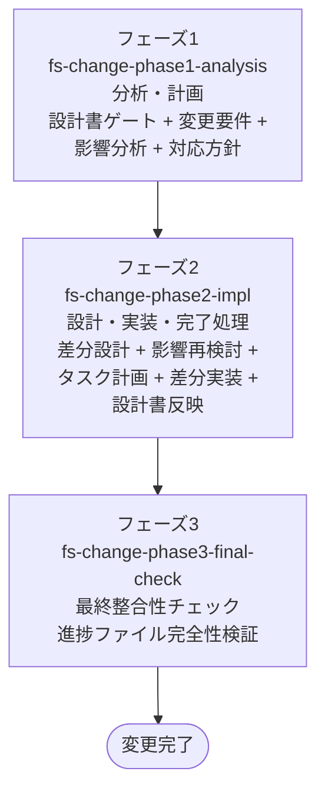

# 変更ワークフロー

既存コードに **機能追加・仕様変更** を加えるためのワークフロー。
影響範囲分析 → 対応方針 → 差分設計 → 差分実装の流れで、設計と実装の両方に変更を反映する。

## 適用場面

| 状況 | 対応 |
|---|---|
| 機能追加 | 本ワークフロー |
| 仕様変更（既存機能の振る舞いを変える） | 本ワークフロー |
| バグの修正（仕様通りに動かない） | バグ修正ワークフロー |
| 振る舞いを変えない内部改善 | リファクタリングワークフロー |
| 設計書がない | 設計逆引きワークフローを先に実行 |

ユーザーの「機能追加」「仕様変更」「振る舞いを変えたい」「修正して（仕様変更の意）」
といった発話をハブスキルが拾い、エントリポイントスキル `fs-change-phase1-analysis` が起動する。

## ワークフローの目的

- 設計書の完了状態を確認した上で、変更要求を受け止める
- 既存設計書 + 既存コード + 起因元ドキュメントを分析して影響範囲を確定する
- OCP（Open-Closed Principle）に基づく対応方針を決定する
- 差分設計書（`delta-design.md`）を before → after 形式で作成し、QA APPROVED を得る
- 差分タスクリストで実装し、リグレッションを起こさない
- ワークフロー完了時に既存設計書へ反映する

## フェーズの流れ

### フェーズ一覧

| 順序 | フェーズスキル | 役割 |
|---|---|---|
| 1 | `fs-change-phase1-analysis` | 分析・計画。設計書ゲート（HARD-GATE）+ 変更要件定義（`change-requirements.md`）+ 影響範囲分析 + 起因元フォルダ統合判定 + OCP に基づく対応方針策定（`approach.md`） |
| 2 | `fs-change-phase2-impl` | 設計・実装・完了処理。差分設計（`delta-design.md`、before → after 形式）+ 差分設計 QA + 影響範囲再検討 + 差分タスクリスト作成（`delta-task-list.md`）+ 多段階コードレビューによる差分実装 + 設計書反映（`doc-sync`）|
| 3 | `fs-change-phase3-final-check` | 最終整合性チェック。`progress-final-checker` による全フェーズ実行整合性の独立検証 + 一時ファイル削除 + 変更WF全体のコミット |

## ゲート

### 設計書ゲート（フェーズ1）

`design-gate` 共通スキルが doc-index.md を読んで判定する。FAIL なら設計ワークフロー or
設計逆引きワークフローへ誘導してから戻ってくる。

### 差分設計 QA（フェーズ2の差分設計区画・影響範囲再検討区画で随時）

`design-qa-dispatch` 共通スキルが、差分が触る設計領域に応じて以下のQAレビューアーエージェントを呼ぶ。

| QAレビューアーエージェント | 呼ばれる条件 | 役割 |
|---|---|---|
| `delta-design-qa-agent` | **常に呼ばれる** | 差分設計書本体の品質判定（before → after 妥当性、影響範囲外への変更検出、既存設計との矛盾検出） |
| `requirements-qa-agent` | 要件に影響がある場合 | 要件 + 開発計画 + 開発環境定義への波及確認 |
| `architecture-qa-agent` | アーキテクチャに影響がある場合 | レイヤード構造 / GUI への波及確認 |
| `object-design-qa-agent` | オブジェクト設計に影響がある場合 | クラス・インターフェース変更の妥当性 |
| `final-design-qa-agent` | インフラ IF / プログラム構成に影響がある場合 | フォルダ配置・import ルールへの波及確認 |

REJECTED 後の修正には **再 QA を必ず実施する**。Iron Law。

### 多段階コードレビュー（フェーズ2の差分実装区画のタスクごと）

ホワイトリスト3エージェント体制で、1 タスクごとに工程内並列化（実装∥テスト実装 → テスト実行 →
設計準拠∥コード品質レビュー）を **省略禁止** で全工程実行する。パイプライン全体は
[`multi-stage-code-review` 共通スキル](../03-common-skills/impl.md#multi-stage-code-review)
が司る。詳細はそちらを参照。実装ワークフローと同じパイプラインを使う。

### 最終整合性チェック（フェーズ3）

`progress-final-checker` エージェントが全フェーズのセッション履歴と進捗ファイルを照合し、
フェーズ省略・工程飛ばしがないかを独立検証する。PASS で進捗ファイルを ✅ 完了 に更新し、
FAIL なら問題フェーズ以降を巻き戻してやり直す。

## 主要成果物

| 成果物 | 作成フェーズ | 内容 |
|---|---|---|
| `change-requirements.md` | 1 | 変更要件 |
| `impact-analysis.md` | 1（作成）/ 2（差分設計を踏まえ更新） | 影響範囲（既存設計書 + 既存コード + 起因元フォルダ） |
| `approach.md` | 1 | OCP に基づく対応方針 |
| `delta-design.md` | 2 | 差分設計書（before → after 形式。規模が大きい場合は索引 + 分割ファイル構成） |
| `delta-task-list.md` | 2 | 依存関係に基づく差分タスクリスト |
| `impl-process-checklist.md` | 2 | 工程チェック表 |
| 実装コード差分 | 2 | プロジェクト本体への変更 |
| 既存設計書（更新後）/ `history.md` | 2 | `doc-sync` 経由で差分設計をマージ + 変更履歴を初期作成 |

## Iron Law

- **NO PHASE SHALL BE SKIPPED, NO MATTER THE REASON**: フェーズ省略禁止
- **NO DIRECT WORK BY THE WORKFLOW ORCHESTRATOR**: 実作業はサブエージェント / 共通スキルに委譲
- **NO QA RE-REVIEW SHALL BE SKIPPED AFTER REJECTION**: REJECTED 後の再 QA を省略禁止
- **NEVER MODIFY EXISTING DESIGN DOCUMENTS DURING DELTA DESIGN PHASE**: 差分設計区画で既存設計書を直接変更禁止。マージはフェーズ2の完了処理区画で `doc-sync` 経由

## 連携する共通スキル

| 共通スキル | 用途 |
|---|---|
| `design-gate` | フェーズ1の設計書ゲート判定 |
| `progress-resume-check` | 各フェーズ先頭（前処理）での再開判定 |
| `phase-compliance-check` | 各フェーズの前処理（verify）/ 後処理（write）での署名検証・進捗更新 |
| `step-history-writer` | 各 Step 完了時のセッション履歴書き出し（フェーズ3の整合性検証用） |
| `user-profile-management` | 各フェーズ前処理（apply）/ 後処理（update）でのプロファイル調整 |
| `folder-merge-check` | フェーズ1の起因元ドキュメントフォルダ統合判定 |
| `user-requirements-definition`（delta モード） | フェーズ2で要件に影響がある場合 |
| `system-requirements-definition`（delta モード） | フェーズ2でシステム要件に影響がある場合 |
| `gui-design`（delta モード） | フェーズ2で GUI に影響がある場合 |
| `ddd-modeling` / `object-design` / `infra-interface-design` / `program-structure-design`（delta モード） | フェーズ2で該当領域に影響がある場合 |
| `design-qa-dispatch` | フェーズ2の差分設計 QA レビューアー呼び出し |
| `impl-task-planning` | フェーズ2のタスク分解 |
| `multi-stage-code-review` | フェーズ2の差分実装での多段階コードレビュー |
| `impl-coding-standards` / `code-quality-review` / `error-handling-review` / `import-review` / `test-review` | 各レビュー観点 |
| `design-sync` | フェーズ2で実装と設計の乖離が発覚した場合の同期 |
| `doc-sync` | フェーズ2の完了処理での差分設計書マージ |
| `doc-index-maintenance` | 各フェーズ後処理での設計書インデックス維持 |
| `pending-issues-management` | スコープ外問題の記録 |
| `git-commit-workflow` | フェーズ3後処理での変更WF全体のコミット |
| `task-orchestration` | 大量タスクの並列分解 |

## 委譲する共通エージェント

| エージェント | 呼ばれる箇所 | 役割 |
|---|---|---|
| `delta-design-qa-agent` | フェーズ2（差分設計 QA） | 差分設計の品質判定（常に呼ばれる） |
| `requirements-qa-agent` | フェーズ2（差分設計 QA・影響時） | 要件レイヤーの波及確認 |
| `architecture-qa-agent` | フェーズ2（差分設計 QA・影響時） | アーキテクチャ層の波及確認 |
| `object-design-qa-agent` | フェーズ2（差分設計 QA・影響時） | オブジェクト設計の波及確認 |
| `final-design-qa-agent` | フェーズ2（差分設計 QA・影響時） | 最終設計層の波及確認 |
| `micro-impl-agent` | フェーズ2（差分実装） | 1 タスク単位の差分実装・テスト |
| `design-review-agent` | フェーズ2（差分実装） | 設計準拠レビュー + import 検証 |
| `code-review-agent` | フェーズ2（差分実装） | コード品質レビュー + エラーハンドリング検証 |
| `progress-final-checker` | フェーズ3 | ワークフロー全体の実行整合性の独立検証 |
