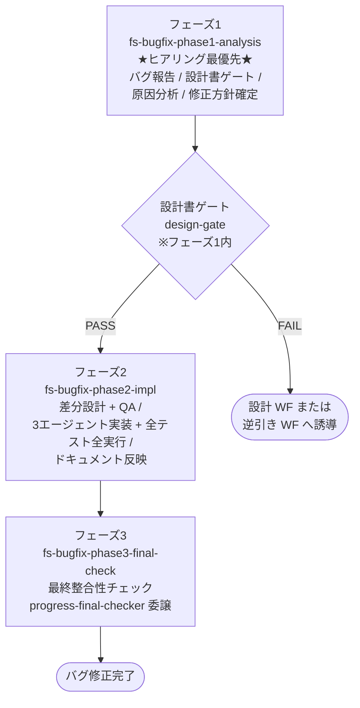

# バグ修正ワークフロー

既存コードのバグを修正するためのワークフロー。
**ヒアリング最優先**で、設計書ゲートはフェーズ1のバグ報告ヒアリング後に置かれる点が他のワークフローと異なる。

## 適用場面

| 状況 | 対応 |
|---|---|
| 動かない・エラー・クラッシュ・期待と違う動作 | 本ワークフロー |
| 仕様通りに動いているが仕様自体を変えたい | 変更ワークフロー |
| 振る舞いを変えずに内部だけ改善 | リファクタリングワークフロー |

ユーザーの「バグ」「動かない」「エラー」「クラッシュ」「壊れた」といった発話を
ハブスキルが拾い、エントリポイントスキル `fs-bugfix-phase1-analysis` が起動する。

## ワークフローの目的

- まずユーザーの困りごと（バグ報告）を聞き取る
- 設計書ゲートを通過した後、再現性確認・原因特定でバグの再現性と原因候補を特定する
- 原因分析でバグの根本原因を特定する
- 原因 / 修正方針 / 修正種別の三つ組をユーザーと合意する
- 差分設計書（`fix-design.md`）を before → after で作成し、QA APPROVED を得る
- リグレッションテストを必ず含めた実装を行い、全テスト全実行で品質を確認する
- ワークフロー完了時に既存設計書へ反映する

## フェーズの流れ

設計書ゲートはフェーズ1（分析・計画）のバグ報告ヒアリングの **後** に位置する。困っている人を待たせないため、
まず話を聞いてから設計書の状態を確認する。Iron Law: HEARING FIRST。

### フェーズ一覧

| 順序 | フェーズスキル | 役割 |
|---|---|---|
| 1 | `fs-bugfix-phase1-analysis` | バグ報告ヒアリング → 設計書ゲート → 再現性確認・原因特定 → 原因分析 → フォルダ統合判定 → 修正方針確定（`bug-report.md` / `bug-analysis.md` / `fix-plan.md`） |
| 2 | `fs-bugfix-phase2-impl` | 差分設計 + 差分設計 QA → タスク計画 → 3エージェント体制で差分実装 + リグレッションテスト + 全テスト全実行 → 設計書反映（`fix-design.md` / `delta-task-list.md` / 実装コード / `history.md`） |
| 3 | `fs-bugfix-phase3-final-check` | ワークフロー全体の実行整合性チェック（`progress-final-checker` に委譲） + コミット |

各フェーズは旧フェーズの作業を内包する:

- フェーズ1（分析・計画）= 旧フェーズ1〜3（バグ報告 / 原因分析 / 修正方針確定）
- フェーズ2（設計・実装・ドキュメント反映）= 旧フェーズ4〜6（修正設計 / 実装 / ドキュメント反映）
- フェーズ3（最終整合性チェック）= 旧フェーズ7

## ゲート

### 設計書ゲート（フェーズ1内・バグ報告ヒアリングの後）

`design-gate` 共通スキルがバグ報告ヒアリング後に動く。FAIL なら設計書作成側のワークフローへ誘導。

### 差分設計 QA（フェーズ2）

`design-qa-dispatch` 共通スキルが差分の影響領域に応じてQAレビューアーエージェントを呼ぶ。
`delta-design-qa-agent` は **常に呼ばれる**。詳細は変更ワークフローと同じ仕組み。

### リグレッションテスト + 全テスト全実行（フェーズ2のタスクごと）

バグ修正特有の Iron Law として、各タスクで以下を行う:

- 修正対象に対するリグレッションテスト（バグ再現テスト）を必ず作成
- タスク完了時に **既存テスト全実行** で他の機能を壊していないことを確認

タスクの統合・テスト全実行の省略は禁止。

### 最終整合性チェック（フェーズ3）

`progress-final-checker` エージェントがフェーズ1〜2のセッション履歴を検証し、
ワークフロー全体の実行整合性を独立して判定する。PASS で完了、FAIL なら該当フェーズへ差し戻す。

## 主要成果物

| 成果物 | 作成フェーズ | 内容 |
|---|---|---|
| `bug-report.md` | 1 | 症状・再現手順・期待動作・実際の動作・環境情報 |
| `bug-analysis.md` | 1 | 根本原因 + 影響範囲 + 起因元ドキュメントフォルダ |
| `fix-plan.md` | 1 | 原因 / 修正方針 / 修正種別（コード修正 / 設計修正 / 仕様変更扱い） + 副作用リスク + リグレッションテスト方針 |
| `fix-design.md` | 2 | 差分設計書（before → after + リグレッションテスト設計。規模が大きい場合は索引 + 分割ファイル構成） |
| `delta-task-list.md` / `impl-process-checklist.md` | 2 | 差分タスクリスト + 工程チェック表 |
| 実装コード差分 + リグレッションテスト | 2 | プロジェクト本体への変更 |
| 既存設計書（更新後） / `history.md` | 2 | `doc-sync` 経由で `fix-design.md` をマージ + バグ修正履歴を初期作成 |

## Iron Law

- **HEARING FIRST**: 環境チェック・テスト実行・設計書確認より先にバグ内容のヒアリングを行う
- **NO PHASE SKIPPING**: 緊急度・修正の単純さを理由にフェーズ省略禁止
- **NO IMPLEMENTATION WITHOUT QA-APPROVED DESIGN**: QA APPROVED なしに実装フェーズへ進めない
- **RE-QA AFTER EVERY FIX IS MANDATORY**: REJECTED 後の修正に対する再 QA を必ず実施
- **NEVER MODIFY EXISTING DESIGN DOCUMENTS DURING DELTA DESIGN PHASE**: 差分設計フェーズで既存設計書を直接変更禁止
- **NO TASK PROCEEDS WITHOUT FULL REVIEW AND ALL TESTS PASSING**: レビュー全 PASS と全テストパスなしに次タスクへ進めない
- **NO TASK MERGING — EVER**: 差分タスクの統合実装を禁止

## 修正種別による分岐

`fs-bugfix-phase1-analysis` の修正方針確定で確定する修正種別により、フェーズ2以降の進め方が分岐する。

| 修正種別 | 内容 | フェーズ2以降 |
|---|---|---|
| コード修正 | 設計通りに動いていなかった | 通常の差分設計 → 実装 |
| 設計修正 | 設計が間違っていた | 設計書側の修正を含む差分設計 → 実装 |
| 仕様変更扱い | バグではなく仕様変更が妥当 | バグ修正ワークフローを終了し、変更ワークフローへ移行 |

## 連携する共通スキル

| 共通スキル | 用途 |
|---|---|
| `design-gate` | フェーズ1のバグ報告ヒアリング後の設計書ゲート判定 |
| `progress-resume-check` | フェーズ先頭での再開判定 |
| `rules-distribute`（skill モード） | フェーズ固有ルールの配置・撤去 |
| `folder-merge-check` | フェーズ1の起因元ドキュメントフォルダ統合判定 |
| `design-qa-dispatch` | フェーズ2のQAレビューアー呼び出し |
| `impl-task-planning` | フェーズ2のタスク分解 |
| `multi-stage-code-review` | フェーズ2の多段階コードレビュー |
| `impl-coding-standards` / `code-quality-review` / `error-handling-review` / `import-review` / `test-review` | 各レビュー観点 |
| `design-sync` | 実装と設計の乖離が発覚した場合の同期 |
| `doc-sync` | フェーズ2の差分設計書マージ |
| `doc-index-maintenance` | 設計書更新後のインデックス維持 |
| `step-history-writer` | 各 Step 完了時のセッション履歴書き出し（フェーズ3の検証に使用） |
| `git-commit-workflow` | フェーズ3完了時のコミット |
| `pending-issues-management` | スコープ外問題の記録 |
| `user-requirements-definition` / `system-requirements-definition` 等（delta モード） | 設計修正種別の場合に該当領域を更新 |

## 委譲する共通エージェント

| エージェント | 呼ばれる箇所 | 役割 |
|---|---|---|
| `delta-design-qa-agent` | フェーズ2 | 差分設計の品質判定（常に呼ばれる） |
| `requirements-qa-agent` / `architecture-qa-agent` / `object-design-qa-agent` / `final-design-qa-agent` | フェーズ2（影響時） | 該当領域の波及確認 |
| `micro-impl-agent` | フェーズ2 | 1 タスク単位の実装・テスト・テスト実行 |
| `design-review-agent` | フェーズ2 | 設計準拠レビュー + 過去不具合修正の保持確認 |
| `code-review-agent` | フェーズ2 | コード品質レビュー + エラーハンドリング検証 |
| `progress-final-checker` | フェーズ3 | ワークフロー全体の実行整合性の独立検証 |
