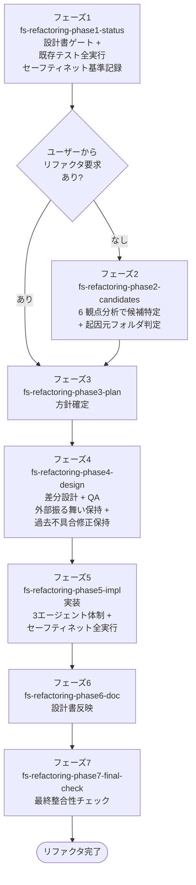

# リファクタリングワークフロー

外部振る舞いを変えずに **内部構造を改善** するためのワークフロー。
セーフティネット（既存テスト全実行）で外部振る舞いの保持を機械的に保証する。

## 適用場面

| 状況 | 対応 |
|---|---|
| 内部構造の改善・コード品質向上・技術的負債解消 | 本ワークフロー |
| 機能追加・仕様変更（振る舞いが変わる） | 変更ワークフロー |
| バグ修正 | バグ修正ワークフロー |

ユーザーの「リファクタ」「内部構造」「コード品質」「技術的負債」「クリーンアップ」
といった発話をハブスキルが拾い、エントリポイントスキル `fs-refactoring-phase1-status` が起動する。

## ワークフローの目的

- 設計書ゲートを通過し、現状把握とセーフティネット基準を確立する
- リファクタリング候補を 6 観点で体系的に分析し、優先順位を付ける
- ユーザーが「何がどう変わるか」を理解した状態でリファクタリング方針に合意する
- 差分設計書（`refactoring-design.md`）を before → after で作成し、QA APPROVED を得る
- 全タスク完了後の動作確認Stepで既存テスト全実行し外部振る舞いの保持を確認する
- ワークフロー完了時に既存設計書へ反映する

## フェーズの流れ

### フェーズ一覧

| 順序 | フェーズスキル | 役割 |
|---|---|---|
| 1 | `fs-refactoring-phase1-status` | 設計書ゲート + 既存テスト全実行でセーフティネット基準を記録 |
| 2 | `fs-refactoring-phase2-candidates` | 6 観点（重複 / 巨大化 / 命名 / 結合度 / 依存方向 / テスタビリティ等）で候補特定 + 起因元フォルダ判定 |
| 3 | `fs-refactoring-phase3-plan` | ユーザーが日常言葉で before → after をイメージできる形での方針合意 |
| 4 | `fs-refactoring-phase4-design` | 差分設計書（`refactoring-design.md`）作成 + 差分設計 QA |
| 5 | `fs-refactoring-phase5-impl` | 3エージェント体制で実装 + 動作確認Stepでセーフティネット全実行（1回） |
| 6 | `fs-refactoring-phase6-doc` | 差分設計を既存設計書にマージ + コミット |
| 7 | `fs-refactoring-phase7-final-check` | ワークフロー全体の最終整合性チェック |

## ゲート

### 設計書ゲート + セーフティネット基準（フェーズ1）

`design-gate` で設計書の完了状態を判定したうえで、`dev-environment.md` 記載のテスト実行コマンドで
既存テストを全実行し、PASS 数 / FAIL 数 / スキップ数を **基準値として記録** する。

この基準値はフェーズ5のセーフティネット判定に使われる。基準値の記録なしにリファクタリングへ
進むことは Iron Law 違反。

### 差分設計 QA（フェーズ4）

`design-qa-dispatch` 共通スキルが、差分が触る設計領域に応じてQAレビューアーエージェントを呼ぶ。
`delta-design-qa-agent` は **常に呼ばれる**。

リファクタリング差分設計の特殊検証項目:

- **外部振る舞いの保持**: API シグネチャ・出力結果・エラー仕様が before と完全一致すること
- **過去不具合修正の保持**: コミット履歴で確認できる過去のバグ修正が、リファクタ後も保持されていること
- **import ルール / レイヤー依存方向の遵守**: リファクタによる依存方向の崩れがないこと

### セーフティネット（フェーズ5の動作確認Stepで1回）

全タスク完了後の動作確認Stepで既存テストを全実行し、フェーズ1で記録した基準値と照合する。

| 結果 | 判定 |
|---|---|
| 基準値と完全一致 | PASS（動作確認試験へ進み、ワークフロー完了へ） |
| FAIL 数増加 | 外部振る舞いが変わった証拠。実装ループへ差し戻して修正 |
| スキップ数の不自然な変化 | テストが意図せず無効化された疑い。調査して修正 |

セーフティネット PASS なしにワークフローを完了できない。Iron Law。

## 主要成果物

| 成果物 | 作成フェーズ | 内容 |
|---|---|---|
| `refactoring-progress.md` | 1 | セーフティネット基準値を含む進捗ファイル |
| `refactoring-candidates.md` | 2 | 候補一覧 + 優先順位（ユーザー要求がない場合のみ） |
| `refactoring-request.md` | 1（ユーザー要求がある場合） | ユーザーから引き継がれた要求 |
| `refactoring-plan.md` | 3 | 方針合意内容（before → after を日常言葉で） |
| `refactoring-design.md` | 4 | 差分設計書（before → after 形式） |
| 実装コード差分 | 5 | プロジェクト本体への変更 |
| 既存設計書（更新後） | 6 | `doc-sync` 経由で差分設計をマージ |

## Iron Law

- **NO CHANGE TO EXTERNAL BEHAVIOR**: 外部振る舞いを変えてはならない。テストが落ちたら振る舞いが変わった証拠
- **NO PHASE SKIPPING**: フェーズ省略禁止
- **NO REFACTORING WITHOUT SAFETY NET BASELINE**: セーフティネット基準なしにリファクタリングへ進めない
- **NO IMPLEMENTATION WITHOUT QA-APPROVED DESIGN**: QA APPROVED なしに実装フェーズへ進めない
- **NO WORKFLOW COMPLETION WITHOUT SAFETY NET PASS**: 動作確認Stepでのセーフティネット全実行 PASS なしにワークフローを完了できない

## 連携する共通スキル

| 共通スキル | 用途 |
|---|---|
| `design-gate` | フェーズ1の設計書ゲート判定 |
| `progress-resume-check` | フェーズ先頭での再開判定 |
| `rules-distribute`（skill モード） | フェーズ固有ルールの配置・撤去 |
| `folder-merge-check` | フェーズ2の起因元ドキュメントフォルダ統合判定 |
| `design-qa-dispatch` | フェーズ4のQAレビューアー呼び出し |
| `impl-task-planning` | フェーズ4のタスク分解 |
| `multi-stage-code-review` | フェーズ5の多段階コードレビュー |
| `impl-coding-standards` / `code-quality-review` / `error-handling-review` / `import-review` / `test-review` | 各レビュー観点 |
| `design-sync` | 実装と設計の乖離が発覚した場合の同期 |
| `doc-sync` | フェーズ6の差分設計書マージ |
| `doc-index-maintenance` | 設計書更新後のインデックス維持 |
| `git-commit-workflow` | フェーズ完了時 / QA APPROVED 後のコミット |
| `pending-issues-management` | スコープ外問題の記録 |
| `ddd-modeling` / `object-design` / `infra-interface-design` / `program-structure-design`（delta モード） | 該当領域に影響がある場合 |

## 委譲する共通エージェント

| エージェント | 呼ばれる箇所 | 役割 |
|---|---|---|
| `delta-design-qa-agent` | フェーズ3 | 差分設計の品質判定（外部振る舞い保持 + 過去不具合修正保持を含む） |
| `architecture-qa-agent` / `object-design-qa-agent` / `final-design-qa-agent` | フェーズ3（影響時） | 該当領域の波及確認 |
| `micro-impl-agent` | フェーズ4 | 1 タスク単位のリファクタ実装 |
| `design-review-agent` | フェーズ4 | 設計準拠レビュー + import 方向性 + 過去不具合修正の保持確認 |
| `code-review-agent` | フェーズ4 | コード品質レビュー + ダミー実装検出 + 過去不具合再発チェック |
