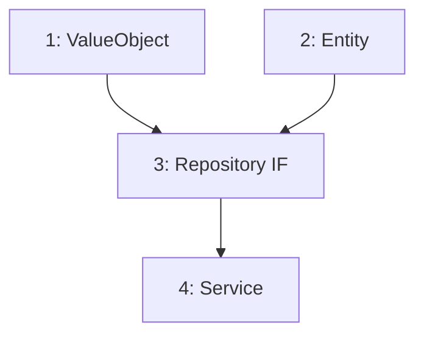

# 実装タスクリスト生成プロンプト（新規作成モード）

## 役割

設計ドキュメントから依存関係グラフを解析し、ユースケース単位で「常にテスト済みの部品だけを使って次の部品が作れる」順序のタスクリストを生成する。

## 前提

- **共通ルール**: `aide-powers:impl-task-planning` スキルの全ルールを前提とする
- **モード**: 新規作成モード（実装ワークフロー専用）

## 入力

以下の設計書を Read で読み込むこと:

- `{specs_dir}/object-design-domain.md` — ドメイン層オブジェクト設計
- `{specs_dir}/object-design-application.md` — アプリケーション層オブジェクト設計
- `{specs_dir}/object-design-infrastructure.md` — インフラストラクチャ層オブジェクト設計
- `{specs_dir}/object-design-presentation.md` — プレゼンテーション層オブジェクト設計
- `{specs_dir}/program-structure.md` — プログラム構成（フォルダ構成・importルール）
- `{specs_dir}/layered-architecture.md` — レイヤードアーキテクチャ設計
- `{specs_dir}/infra-interface-design.md` — インフラ/インターフェース設計

※ `{specs_dir}` = `.aide/specs/{feature_name}/`

## 出力

- `{specs_dir}/impl-task-list.md` — 実装タスクリスト
- `{specs_dir}/impl-process-checklist.md` — 工程チェック表（必須）

※ 工程チェック表（impl-process-checklist.md）の生成手順・行構成（1 工程 = 1 行）・状態記号（⬜/🔄/✅/❌/➖）・監査ルールは `aide-powers:impl-task-planning` スキルの「工程チェック表の生成（必須）」に従うこと（本プロンプトのステップ7参照）。

## 手順

### ステップ1: 依存関係の抽出

全クラス/モジュールの依存関係を抽出する:

1. 各クラスのコンストラクタ引数の型を確認する
2. 各publicメソッドの引数・戻り値の型ヒントを確認する
3. 外部ライブラリ依存を確認する（標準ライブラリ以外のimport）
4. インターフェース実装関係を確認する

**型ヒント最優先ルール:**
- インターフェースがドメインモデル（エンティティやVO）を引数・戻り値の型に使う場合、そのVO/エンティティをインターフェースより先に実装する
- 依存グラフ上はインターフェースが「依存先なし」に見えても、型ヒントで参照するクラスが未実装なら依存先として扱い後回しにする

### ステップ2: ユースケース単位でグループ化

依存関係グラフを以下のグループに分類する:

- **共通基盤（フェーズ0）**: 複数のユースケースから共有されるクラス群
  - ドメイン層のエンティティ・VO・列挙型
  - インターフェース定義（ABC）
  - 共通ユーティリティ
- **ユースケース別（フェーズ1-N）**: 特定のユースケースに紐づくクラス群
  - アプリケーション層のユースケースクラス
  - インフラストラクチャ層の実装クラス
  - プレゼンテーション層のGUI/CLIコンポーネント

#### グループ化の手順

1. `object-design-application.md` からユースケース一覧を抽出する
2. 各ユースケースの依存先を再帰的にたどり、必要なクラスを全て列挙する
3. 複数のユースケースに共通するクラスは「共通基盤」グループに分類する
4. 各ユースケース固有のクラスをユースケースグループに分類する

### ステップ3: 依存グラフの構築（依存先ベース）

各グループ内で依存関係を依存グラフとして構築する。各タスクには「依存先」（なし、または依存先タスク番号）を明記し、依存先が全て完了したタスクは即座に起動可能とする。

**依存判定ルール:**
- DIPに従い「具象→具象」の依存を排除し、「具象→インターフェース」のみ残す
- 各依存エッジには「依存理由」を1文で記述する（理由が書けない依存は不要なので削除）
- 例: `B → A: BのコンストラクタがAの型を引数に取る`

**依存タイプ別の判定:**

| 依存タイプ | 判定 | 例 |
|-----------|------|-----|
| コンストラクタ引数の型 | 必須依存 | `def __init__(self, repo: IRepository)` → IRepository |
| メソッド引数・戻り値の型 | 必須依存 | `def get() -> Result` → Result |
| 内部実装で参照する型 | 必須依存 | メソッド内で他クラスを直接インスタンス化 |
| 型ヒント上のみで実装に不要 | 削除可 | 抽象型を経由しているケース |
| 具象→具象の直接依存 | DIP適用で削除 | インターフェース経由に変更 |

### ステップ4: 並列実行可能性の判定（依存グラフベース）

依存グラフから自動的に並列実行可能性を導出する:

1. **同一ファイル競合チェック**: 同じファイルを変更するタスク同士は依存関係を作って逐次実行する（並列禁止）
2. **同一テストファイル競合チェック**: 同じテストファイルに書き込むタスク同士は依存関係を作って逐次実行する
3. **依存グラフのみで表現**:
   - 各タスクに「依存先」を明記する（依存先: なし / 依存先: D-001, D-002）
   - 依存先のないタスク = スタート時に並列起動可能
   - 依存先が全て完了したタスク = 即座に並列起動可能（無関係なタスクの完了は待たない）

### ステップ4.5: 並列実行予測の算出

各タスクが完了した時点で並列起動可能になるタスク群を予測する:

1. スタート時に並列起動可能なタスクを列挙する（依存先のないタスク）
2. 各タスクの完了時点で「依存先が全て完了する」タスクを列挙する
3. 並列度メトリクスを算出する:
   - 全タスク数
   - 最大並列度（最大同時起動可能数）
   - 平均並列度
   - クリティカルパス（最長依存連鎖の長さ）
   - 並列化による短縮率

### ステップ5: タスクリストの生成

以下の構成でタスクリストを生成する:

- **フェーズ0: 共通基盤**（全ユースケースが共有するクラス群）
- **フェーズ1-N: ユースケース別**（各ユースケースに紐づくクラス群）
- **各フェーズ末尾: ユーザー試験マイルストーン**

**タスク構造（2層構造）:**
- 親タスク: クラス単位（1ファイル = 1親タスク）
- サブタスク: publicメソッド単位（実装の進捗管理用）

**ユーザー試験マイルストーン:**
- 各ユースケースフェーズの末尾に配置する
- 1つのユースケースがGUI/CLIで動作可能になったら、その都度ユーザーに試験を依頼する
- 全ユースケースの完成を待たない。動作可能な範囲で早期にフィードバックを得る

### ステップ6: 網羅性チェック

設計書との網羅性チェックを実行する（漏れゼロになるまでループ）:

**チェック対象:**
- 全クラス定義（コンストラクタ含む）
- 全publicメソッド
- 定数の塊（モジュールレベルの定数定義）
- 列挙型の全メンバー
- インターフェース定義（ABC）
- 設計書に記載されたヘルパー関数・ユーティリティ関数

**チェック手順:**
1. 設計書の全定義を一覧化する
2. タスクリストの全タスクと照合する
3. 漏れがある場合: 漏れた項目ごとにタスクを追加し、依存関係に基づき適切な位置（依存先が先に実装される順序）に挿入する
4. 漏れがない場合: ループ終了

### ステップ7: 工程チェック表の生成（必須）

タスクリスト（impl-task-list.md）の生成と同時に、`{specs_dir}/impl-process-checklist.md`（工程チェック表）を生成する。これは fs-impl-phase4-execution (aide-powers skill) が各タスクの工程漏れを防ぐためのチェック表である。

- 工程チェック表は **「1 工程 = 1 行」構造**で生成する（1 タスク × 各工程を 1 行ずつ）。生成手順・行構成（プログラムコードタスクは 実装 / テスト実装 / テスト実行 / 設計準拠レビュー / コード品質レビュー の 5 工程行。非プログラム成果物は 実装・設計準拠レビューを実工程行とし、残りを `➖ skip` 行とする）・行キー（`{task_id}::{工程キー}`）・状態記号（`⬜ todo` / `🔄 in-progress` / `✅ done` / `❌ failed` / `➖ skip`）・「状態 / 実行エージェント / output」形式・担当本人による 3 段階更新・ホワイトリスト監査ルールは、`aide-powers:impl-task-planning` スキルの「工程チェック表の生成（必須）」セクションに従うこと

**行キー生成ルール:**
工程チェック表の行キーはサブタスクID単位で生成し、サブタスクがないタスクのみ親タスクIDで行を作る。
- サブタスクがある親タスク: 各サブタスクのIDで行キーを生成する（例: 1.1::implement, 1.2::implement）
  - 親タスクID（例: 1）単体では行キーを作らない
- サブタスクがない親タスク: 親タスクIDで行キーを生成する（例: 0.3::implement）

- 工程行はタスク番号順、同一タスク内は工程キー順（implement → write_test → run_test → spec_review → quality_review）に並べる
- 各工程行の実行エージェントは、その工程キーに対応する担当（実装/テスト実装/テスト実行 = micro-impl-agent、設計準拠レビュー = design-review-agent、コード品質レビュー = code-review-agent）であり、ホワイトリスト（micro-impl-agent / design-review-agent / code-review-agent）のいずれかのみ使用する

工程チェック表を生成していない場合、本プロンプトの成果は未完了とする。

## ユースケースのフェーズ順序の決定基準

1. ユースケース間に依存関係がある場合は、依存される側を先にする
2. 依存関係がない場合は、以下の優先順位で並べる:
   - ユーザーにとって最も価値が高い（コア機能）
   - 他のユースケースの基盤となるもの
   - 独立性が高く早期に動作確認できるもの

## GUI/CLI実装のタイミング

- 各ユースケースフェーズの最後に、そのユースケースに対応するGUI/CLIコンポーネントを実装する
- 1つのユースケースがGUI/CLIで動作可能になったら、その都度ユーザーに試験を依頼する
- 全ユースケースの完成を待たない。動作可能な範囲で早期にフィードバックを得る
- 未実装の機能に対応するUI要素は、ユーザーが「未実装」と明確に分かる状態にしておくこと（例: ボタンを無効化して「未実装」ラベルを表示、タブに「（未実装）」を付記する等）
- ユーザー試験でフィードバックがあれば、次のフェーズに進む前に修正対応する

## 出力フォーマット

```markdown
# 実装タスクリスト: {feature_name}

生成日時: {timestamp}
総タスク数: {N}（親タスク）/ {M}（サブタスク含む総数）
ユースケース数: {K}

## フェーズ0: 共通基盤（全ユースケースが共有）

### 依存グラフ



### 実行リンク

- **並列スタート**: タスク 1, 2（依存先なし、同時に着手可能）
- **リンク**: 1 → 3, 2 → 3, 3 → 4（矢印の左が完了したら右を開始）

### 依存エッジの根拠

各依存エッジについて「なぜ依存しているか」を1文で記述する。理由が書けないエッジは削除する。

| エッジ | 理由 |
|--------|------|
| 1 → 3 | Repository IF のメソッドが ValueObject を引数・戻り値に使用する |
| 2 → 3 | Repository IF のメソッドが Entity を引数・戻り値に使用する |
| 3 → 4 | Service のコンストラクタが Repository IF を依存性注入で受け取る |

**DIP適用ルール:**
- 「具象→具象」の依存は禁止。「具象→インターフェース」のみ依存として残す
- インターフェース定義タスクが完了すれば、依存する全具象タスクが並列起動可能になる

### 並列実行予測

各タスク完了時点で並列起動可能になるタスク群:

| タイミング | 起動可能タスク | 並列度 |
|-----------|---------------|--------|
| スタート時 | [1, 2] | 2 |
| 1, 2 完了時 | [3] | 1 |
| 3 完了時 | [4] | 1 |

### タスク詳細

| # | タスク | ステータス | 対象ファイル | テストファイル | 依存先 | 設計参照 |
|---|--------|-----------|-------------|--------------|--------|---------|
| 1 | ValueObject | ⬜ todo | `src/domain/vo.py` | `tests/domain/test_vo.py` | なし | object-design-domain.md §1 |
| 2 | Entity | ⬜ todo | `src/domain/entity.py` | `tests/domain/test_entity.py` | なし | object-design-domain.md §2 |
| 3 | Repository IF | ⬜ todo | `src/domain/repo.py` | `tests/domain/test_repo.py` | 1, 2 | object-design-domain.md §3 |
| 4 | Service | ⬜ todo | `src/app/service.py` | `tests/app/test_service.py` | 3 | object-design-application.md §1 |

## フェーズ1: {ユースケース名}

（同じ構造: 依存グラフ → 実行リンク → 依存エッジの根拠 → 並列実行予測 → タスク詳細）

### ユーザー試験マイルストーン
- **確認内容**: {ユーザーに試験してもらう内容}
- **前提条件**: フェーズ1の全タスク完了

## 並列度メトリクス（全体）

- 全タスク数: {N}
- 最大並列度: {M}（最大同時起動可能数）
- 平均並列度: {A}
- クリティカルパス: タスク {X} → {Y} → {Z}（長さ {L}）
- 並列化による短縮率: (1 - {L}/{N}) × 100% = {R}% 短縮

## 網羅性チェック結果
- チェック回数: {N}回
- 設計書の総定義数: クラス {A} / publicメソッド {B} / 定数・列挙型 {C}
- タスクリストの親タスク数: {M}
- 最終結果: 漏れなし
```

### ステータス記号

| 記号 | 意味 | 遷移タイミング |
|------|------|---------------|
| ⬜ todo | 未着手 | 初期状態 |
| 🔄 in-progress | 実行中 | タスク開始時 |
| ✅ done | 完了 | 全ステップ完了時 |
| ❌ blocked | ブロック | 依存先未完了等で進行不可 |

### カンバン形式のルール（cline Kanban に準拠 + 依存グラフ精度向上）

各フェーズは以下の要素で構成する:

1. **依存グラフ（Mermaid）**: タスク間の依存関係を視覚的に表現する
   - ノード: `T{番号}[{番号}: {タスク名}]`
   - エッジ: `T{依存元} --> T{依存先}`
2. **実行リンク（テキスト）**: cline形式の矢印記法で実行順序を明記する
   - **並列スタート**: 依存先がないタスク（同時に着手可能なタスク）を列挙
   - **リンク**: `A → B`（Aが完了したらBを開始）、`A → B, A → C`（Aが完了したらBとCを並列で開始）
3. **依存エッジの根拠**: 各依存エッジの理由を1文で記述（理由が書けない依存は削除）
   - DIP適用: 「具象→具象」の依存を排除し「具象→インターフェース」のみ残す
4. **並列実行予測**: 各タスク完了時点で並列起動可能になるタスク群を予測
5. **タスク詳細テーブル**: 各タスクの実行情報（ステータス・ファイル・依存先・設計参照）

**読み方の例:**
- `1 → 3, 2 → 3, 3 → 4` = タスク1と2を並列で開始 → 両方完了したらタスク3 → タスク3完了でタスク4

**実行ルール（最大並列度・依存先ベース）:**
- 依存先が全て ✅ done のタスクは即座に起動可能（他の無関係なタスクの完了を待たない）
- 起動可能なタスクが複数ある場合は全て同時に並列起動する
- 依存先と無関係なタスクの完了を待つ一括待機をしない
- 同一ファイルを変更するタスク同士は依存関係を作って逐次実行する（並列禁止）
- 並列実行可能性は依存グラフ（Mermaid + 実行リンク）と各タスクの「依存先」表記のみで表現する

## 最重要ルール（再確認）

1. **網羅性チェック漏れゼロ**: 設計書の全定義がタスクリストに反映されるまで完了としない
2. **2層構造**: 親タスク=クラス単位（1ファイル）、サブタスク=publicメソッド単位。1サブタスクで変更するファイルは1つだけ、実装するpublicメソッドは1つだけ
3. **依存先を先に実装**: 依存関係を無視した順序でタスクを並べない
4. **型ヒント依存関係を最優先**: インターフェースが参照する型が未実装なら後回しにする

## 報告フォーマット

タスクリスト生成完了後、以下のいずれかのステータスで報告する:

| ステータス | 意味 | 次のアクション |
|---|---|---|
| DONE | タスクリスト生成完了。問題なし | ユーザーに提示して合意を得る |
| DONE_WITH_CONCERNS | 完了したが懸念事項あり | 懸念事項を明記してユーザーに判断を仰ぐ |
| NEEDS_CONTEXT | 設計書に不明点があり、追加情報が必要 | 不明点を明記してユーザーに確認する |
| BLOCKED | 循環依存等の設計上の問題で進行不可 | 問題を報告し、設計の修正を提案する |
