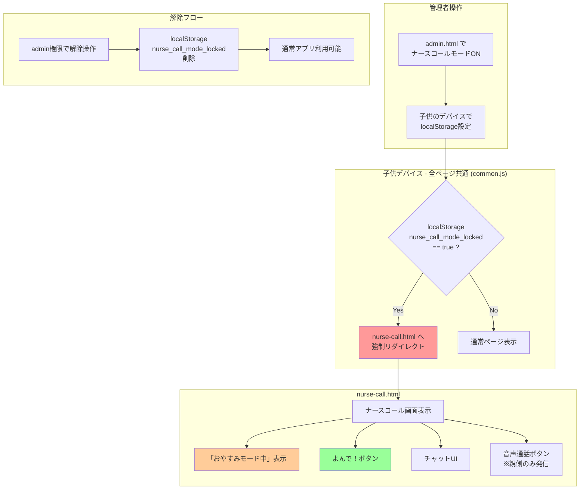
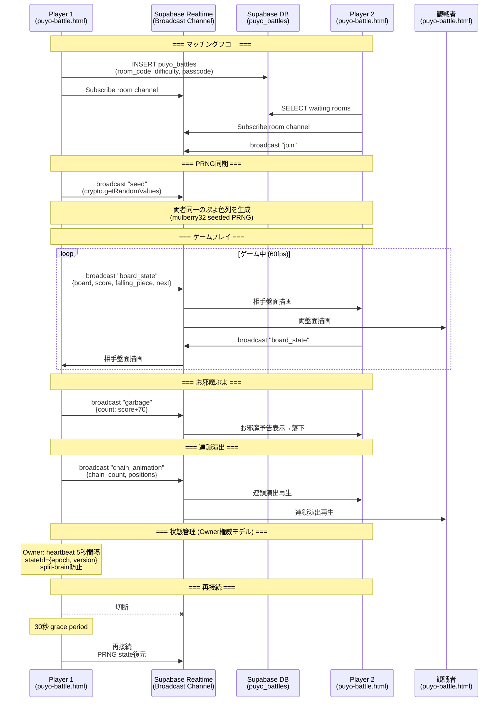
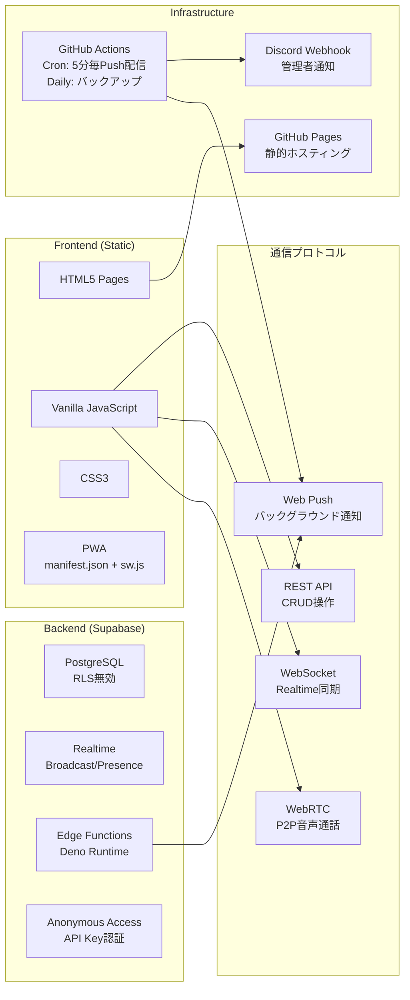

# お小遣い手帳 - アーキテクチャ設計図

## 1. アプリ全体構成図

```mermaid
graph TB
    subgraph "GitHub Pages (Static Hosting)"
        INDEX[index.html<br/>TOPページ]
        CHILD[child.html<br/>個人ページ]
        ADMIN[admin.html<br/>管理者ページ]
        ALLOWANCE[allowance.html<br/>入出金]
        ARCADE[arcade.html<br/>ゲームセンター]
        
        subgraph "ゲーム・学習"
            GAME[game.html<br/>ぷよぷよ]
            PUYO_BATTLE[puyo-battle.html<br/>ぴくぴく対戦]
            TETRIS[tetris.html<br/>テトミン]
            BLAST[blast.html<br/>ピクミンブラスト]
            MATH_OLY[math-olympiad.html<br/>算数オリンピック]
            MATH_BATTLE[math-battle.html<br/>算数バトル]
            KANJI[kanji-test.html<br/>漢字テスト]
            SUIKA[suika.html<br/>すいかRPG]
            OLIMAR[olimar.html<br/>オリマー]
            TRPG[trpg-cthulhu.html<br/>クトゥルフTRPG]
            COCKROACH[cockroach-poker.html<br/>ごきぶりポーカー]
            QUARTO[quarto.html<br/>クアルト]
            QUORIDOR[quoridor.html<br/>コリドール]
            MEMORY[memory-game.html<br/>神経衰弱]
            BLOKUS[blokus.html<br/>ブロックス]
        end
        
        subgraph "情報・コンテンツ"
            SCIENCE[today-science.html<br/>今日のサイエンス]
            SCP[scp-archive.html<br/>今日のSCP]
            TICKET[ticket.html<br/>あそびチケット]
            NOTES[family-notes.html<br/>家族ノート]
        end
        
        subgraph "ナースコール"
            NURSE[nurse-call.html<br/>4ビュー: ホーム/チャット/通話/体温<br/>WebRTC音声+ビデオ通話<br/>即時Push通知]
        end
        
        subgraph "共通JS"
            COMMON[js/common.js<br/>共通処理・リダイレクト制御]
            SW[sw.js<br/>Service Worker]
        end
    end
    
    subgraph "Supabase Backend"
        DB[(PostgreSQL<br/>全テーブル)]
        REALTIME[Realtime<br/>Broadcast/Presence]
        EDGE[Edge Functions]
        STORAGE[Storage]
    end
    
    subgraph "外部サービス"
        DISCORD[Discord Webhook<br/>通知]
        GITHUB_ACTIONS[GitHub Actions<br/>Cron Jobs]
        WEB_PUSH[Web Push API<br/>ブラウザ通知]
        WEBRTC[WebRTC<br/>音声通話]
        STUN_TURN[STUN/TURN Server<br/>NAT越え]
    end
    
    INDEX --> CHILD
    INDEX --> ADMIN
    INDEX --> ARCADE
    INDEX --> NURSE
    ARCADE --> GAME
    ARCADE --> TETRIS
    ARCADE --> BLAST
    ARCADE --> OLIMAR
    ARCADE --> SUIKA
    ARCADE --> MATH_OLY
    ARCADE --> KANJI
    ARCADE --> TRPG
    ARCADE --> COCKROACH
    ARCADE --> QUARTO
    ARCADE --> QUORIDOR
    ARCADE --> MEMORY
    ARCADE --> BLOKUS
    CHILD --> NURSE
    
    COMMON --> |リダイレクト制御| NURSE
    
    PUYO_BATTLE --> REALTIME
    MATH_BATTLE --> REALTIME
    NURSE --> REALTIME
    NURSE --> EDGE
    NURSE --> WEBRTC
    WEBRTC --> STUN_TURN
    
    EDGE --> WEB_PUSH
    GITHUB_ACTIONS --> WEB_PUSH
    GITHUB_ACTIONS --> DB
    
    INDEX --> DB
    CHILD --> DB
    ADMIN --> DB
    GAME --> DB
```



## 2. ナースコール機能 アーキテクチャ図

```mermaid
sequenceDiagram
    participant C as 子供デバイス<br/>(nurse-call.html)
    participant SB_RT as Supabase Realtime<br/>(Broadcast Channel)
    participant SB_DB as Supabase DB<br/>(nurse_calls, nurse_call_messages)
    participant EDGE as Edge Function<br/>(push-nurse-call)
    participant PUSH as Web Push API
    participant P as 親デバイス<br/>(admin端末)
    participant WEBRTC as WebRTC<br/>(音声通話)
    
    Note over C,P: === 呼び出しフロー ===
    
    C->>EDGE: POST /push-nurse-call<br/>{child_id, child_name, reason}
    EDGE->>SB_DB: INSERT nurse_calls
    EDGE->>PUSH: 即時Push通知送信<br/>(role='admin'の全端末)
    PUSH->>P: 🔔 ○○がよんでいます
    
    P->>SB_RT: broadcast "response"<br/>{type: "iku_yo", call_id}
    SB_RT->>C: 「今行くよ💨」ポップ表示
    P->>SB_DB: UPDATE nurse_calls<br/>SET responded_at
    
    Note over C,P: === チャットフロー ===
    
    C->>SB_RT: broadcast "chat"<br/>{sender: "child", text}
    SB_RT->>P: メッセージ受信・表示
    C->>SB_DB: INSERT nurse_call_messages
    C->>EDGE: 即時Push通知（1分間隔制限）
    EDGE->>PUSH: 💬チャット通知
    
    P->>SB_RT: broadcast "chat"<br/>{sender: "parent", text}
    SB_RT->>C: メッセージ受信・表示
    P->>SB_DB: INSERT nurse_call_messages
    
    Note over C,P: === 体温記録フロー ===
    
    C->>SB_DB: INSERT temperature_logs<br/>{child_name, temperature, measured_at}
    C->>SB_RT: broadcast "chat"<br/>🌡️ 36.8℃
    C->>EDGE: 即時Push通知<br/>🌡️ たいおん 36.8℃
    EDGE->>PUSH: Push配信
    
    Note over C,P: === 音声通話フロー ===
    
    C->>SB_RT: broadcast "voice_state"<br/>{state: "ringing"}
    SB_RT->>P: 着信表示「でんわにでる」
    P->>P: ユーザータップ → マイク取得
    C->>SB_RT: broadcast "signal"<br/>{type: "offer", sdp}
    SB_RT->>P: SDP Offer受信
    P->>SB_RT: broadcast "signal"<br/>{type: "answer", sdp}
    SB_RT->>C: SDP Answer受信
    
    loop ICE候補交換
        C->>SB_RT: broadcast "ice_candidate"
        SB_RT->>P: ICE受信
        P->>SB_RT: broadcast "ice_candidate"
        SB_RT->>C: ICE受信
    end
    
    P<-->WEBRTC: 音声ストリーム確立
    WEBRTC<-->C: P2P音声通話
```

## 3. ナースコールモード（デバイスロック）フロー



## 4. ぴくぴく対戦 アーキテクチャ図



## 5. 技術スタック概要



## 6. ゲームセンター 一覧

| ゲーム | ファイル | タイプ | DB使用 |
|--------|----------|--------|--------|
| ぴくぴく（ぷよぷよ） | game.html / puyo-battle.html | パズル（対戦あり） | game_rankings, puyo_battles |
| テトミン | tetris.html | 落ちものパズル | tetris_rankings |
| ピクミンブラスト | blast.html | 配置パズル | blast_rankings |
| オリマーの冒険 | olimar.html | 探索RPG | localStorage |
| すいかが食べたい | suika.html | 3D RPG | なし |
| すいか原作Java版 | suika-original.html | Java Applet | なし |
| 算数オリンピック | math-olympiad.html | 学習 | math_olympiad_answers |
| 漢字50問テスト | kanji-test.html | 学習 | game_settings |
| クトゥルフTRPG | trpg-cthulhu.html | TRPG（admin限定） | なし |
| ごきぶりポーカー | cockroach-poker.html | カードゲーム（CPU対戦） | なし |
| クアルト | quarto.html | ボードゲーム（2人） | なし |
| コリドール | quoridor.html | ボードゲーム（2人） | なし |
| 神経衰弱 | memory-game.html | 記憶力カードゲーム | memory_rankings |
| ブロックス | blokus.html | ボードゲーム（1-4人、CPU対戦） | blokus_rankings |
